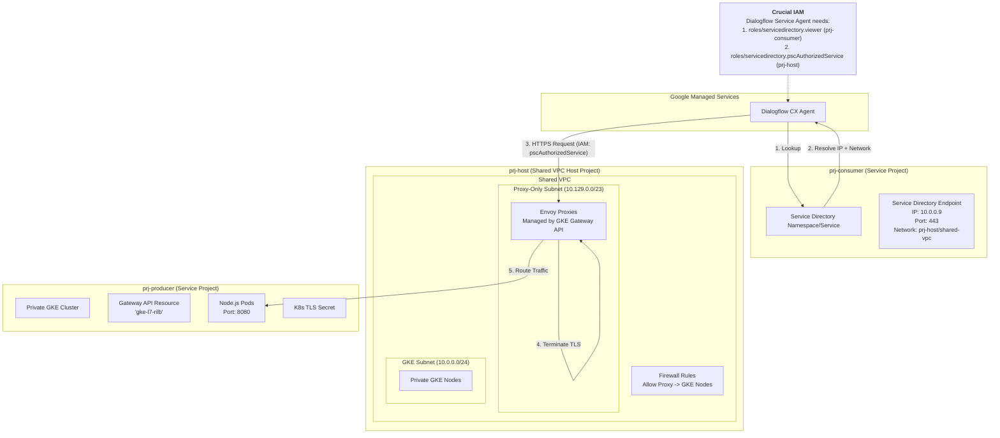

Phase 1: DialogFlow CX + Service Directory + ILB + Cloud Run => Working fine
Phase 2: Dialogflow CX → Service Directory (DNS resolution) → Internal HTTPS Gateway (Envoy Proxy with SSL) → Private GKE Nodes → Node.js Express App. => Working fine

Note: All resources in  same project (vpc, subnet, ilb, cloud run, service directory)

In phase 3, i would like to introduce a shared network and cross project.
e.g prj-producer, prj-consumer
Producer will have application deployed in Cloud Run/GKE with ILB
Consumer wil have DialogFlow Agent and Service Directory

I have tried this usecase, i'm getting Service Directory is not able to identify error, while testing via simulator.

Please guide me on this.

This is a common transition when moving from a POC to an Enterprise architecture. In a cross-project (Hub-and-Spoke or Shared VPC) setup, the "Service Directory is not able to identify" error usually stems from **IAM permission gaps** across project boundaries or a **mismatched Network Resource Path**.

Here is the guide to setting up **Phase 3: Cross-Project Dialogflow CX Webhooks.**

---

### The Architecture
*   **Host Project (`prj-host`):** Contains the Shared VPC and Subnets.
*   **Producer Project (`prj-producer`):** Contains the GKE Cluster and the Internal Load Balancer (ILB/Gateway).
*   **Consumer Project (`prj-consumer`):** Contains the Dialogflow CX Agent and the Service Directory.

---

### Step 1: Correct the Service Directory Endpoint
When creating the endpoint in the **Consumer Project**, the `--network` flag must point to the **Host Project's** VPC, not a local project reference.

**Run this in the Consumer Project:**
```bash
# Delete the old endpoint
gcloud service-directory endpoints delete gke-endpoint \
    --service=webhook-service --namespace=gke-webhooks --location=[REGION]

# Create the new endpoint pointing to the SHARED VPC
gcloud service-directory endpoints create gke-endpoint \
    --service=webhook-service \
    --namespace=gke-webhooks \
    --location=[REGION] \
    --address=10.0.0.9 \
    --port=443 \
    --network=projects/prj-host/global/networks/shared-vpc-name
```

---

### Step 2: Cross-Project IAM Permissions (Crucial)
Dialogflow in the Consumer project needs specific rights to "look" into the Host project's network and the Service Directory entries.

#### 1. Identify the Dialogflow Service Agent
In the **Consumer Project**, find the email:
`service-[CONSUMER_PROJECT_NUMBER]@gcp-sa-dialogflow.iam.gserviceaccount.com`

#### 2. Grant Permissions in the CONSUMER Project
The agent needs to see its own Service Directory:
```bash
gcloud projects add-iam-policy-binding prj-consumer \
    --member="serviceAccount:service-[CONSUMER_PROJECT_NUMBER]@gcp-sa-dialogflow.iam.gserviceaccount.com" \
    --role="roles/servicedirectory.viewer"
```

#### 3. Grant Permissions in the HOST Project
This is where most setups fail. The Dialogflow agent needs permission to authorize a private connection to the VPC located in the **Host Project**.

```bash
gcloud projects add-iam-policy-binding prj-host \
    --member="serviceAccount:service-[CONSUMER_PROJECT_NUMBER]@gcp-sa-dialogflow.iam.gserviceaccount.com" \
    --role="roles/servicedirectory.pscAuthorizedService"
```
*Note: Even though you aren't using "PSC" explicitly, Dialogflow uses the PSC logic internally to bridge the gap to the private ILB.*

---

### Step 3: Shared VPC Firewall Rules
Ensure the Host Project's firewall allows traffic from the **Proxy-only subnet** to the **GKE Nodes** (Producer Project).

In the **Host Project**:
```bash
gcloud compute firewall-rules create allow-cross-project-lb \
    --network=shared-vpc-name \
    --action=ALLOW \
    --direction=INGRESS \
    --source-ranges=10.129.0.0/23 \
    --rules=tcp:8080
```

---

### Step 4: Verify Routing Visibility
For Dialogflow to reach the GKE ILB across projects, the projects must be linked via **Shared VPC** or **VPC Peering**.

1.  **If using Shared VPC:** Ensure both `prj-producer` and `prj-consumer` are "Service Projects" attached to `prj-host`.
2.  **If using VPC Peering:** Ensure the peering between Producer VPC and Consumer VPC is active and **"Export Custom Routes"** is enabled on the Producer side, and **"Import Custom Routes"** is enabled on the Consumer side.

---

### Troubleshooting "Service Directory not able to identify"

If the error persists in the Dialogflow Simulator, check these three things:

1.  **Region Consistency:** Dialogflow Agents, Service Directory Namespaces, and the ILB **must** all be in the same region (e.g., `us-central1`). Cross-region Service Directory resolution is not supported for Dialogflow webhooks.
2.  **The Network String:** Run `gcloud service-directory endpoints describe gke-endpoint ...`. Ensure the `network` field looks exactly like:
    `projects/prj-host/global/networks/shared-vpc-name`.
    If it says `projects/prj-consumer/...`, it will fail because the ILB doesn't exist in that project's network context.
3.  **The Simulator Cache:** The Dialogflow simulator sometimes caches webhook failures. After applying IAM changes, wait 2 minutes and **refresh the entire browser page** before testing again.

### Summary Checklist for Phase 3:
*   [ ] **Endpoint Network:** Points to Host Project VPC.
*   [ ] **IAM (Consumer):** Dialogflow Agent has `servicedirectory.viewer`.
*   [ ] **IAM (Host):** Dialogflow Agent has `servicedirectory.pscAuthorizedService`.
*   [ ] **Firewall:** Host project allows the Producer's proxy range.
*   [ ] **Certificates:** The `webhook.crt` is still uploaded to the Dialogflow Webhook config in the Consumer project.


This architecture diagram illustrates the **Phase 3: Multi-Project Shared VPC** setup. This is a robust enterprise-grade design that separates concerns: the consumer manages the AI agent, the producer manages the application, and the host project manages the networking.

### Phase 3: Cross-Project GKE Webhook Architecture



---

### Detailed Resource Breakdown

#### 1. prj-consumer (The AI Layer)
*   **Dialogflow CX Agent:** The conversational interface.
*   **Service Directory:** Acts as the bridge. Crucially, the **Endpoint** registered here contains the IP of the Load Balancer but is tagged with the `prj-host` network ID. This tells Dialogflow: *"To reach 10.0.0.9, you must enter through the Shared VPC in prj-host."*

#### 2. prj-host (The Networking Layer)
*   **Shared VPC:** The central nervous system.
*   **Proxy-only Subnet:** A mandatory small subnet (`/23` or `/26`) where Google Cloud deploys Envoy proxies for the Regional Internal Load Balancer created by GKE.
*   **Firewall Rules:** Must allow traffic from the Proxy-only subnet to the GKE nodes on port `8080`.

#### 3. prj-producer (The Application Layer)
*   **Private GKE Cluster:** Runs the pods. It is a "Service Project" attached to the `prj-host`.
*   **Gateway API (`gke-l7-rilb`):** This is the Controller. When you apply your `Gateway` manifest in this project, it talks to the Google Cloud APIs to provision an ILB in the **Host Project's** VPC.
*   **TLS Secret:** Your `webhook.crt` and `webhook.key`. The Envoy proxies in the host project use this to handle the HTTPS handshake.

---

### Why Phase 3 is different from Phase 2:

1.  **Network Identity:** In Phase 2, the network was local. In Phase 3, the network resource path changes to `projects/prj-host/global/networks/vpc-name`.
2.  **Dialogflow Service Agent IAM:** 
    *   In Phase 2, you granted permissions on one project. 
    *   In Phase 3, you must grant `roles/servicedirectory.pscAuthorizedService` on **`prj-host`**. Without this, the Dialogflow simulator will say "Service Directory not found" because it doesn't have permission to "walk into" the host project's network.
3.  **Visibility:** The Load Balancer frontend IP exists in the Shared VPC. Any resource connected to that Shared VPC (even in other projects) can reach the webhook, provided firewalls allow it.

### Configuration Check for Phase 3
When you update your Webhook in Dialogflow CX Console:
*   **URL:** `https://webhook.internal/` (Matches your Certificate CN).
*   **Service Directory Namespace:** (The one in `prj-consumer`).
*   **Service Directory Service:** (The one in `prj-consumer`).
*   **CA Certificate:** Paste your `webhook.crt`.